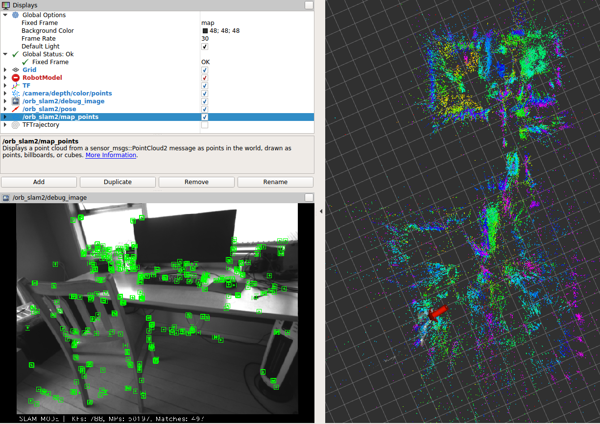

# d435_orb_slam_2

ROS package for running [orb_slam_2_ros](https://github.com/appliedAI-Initiative/orb_slam_2_ros) with a [Realsense D435 RGBD camera](https://www.intelrealsense.com/depth-camera-d435/s).

Package also includes launch file for optionally running [voxblox](https://github.com/ethz-asl/voxblox) mapping. 

Launch files are provided for both stereo and rgbd slam modes. (`slam_stereo.launch` and `slam_rgbd.launch` respectively). 
Stereo mode is recommended as it seems to perform much better than rgbd mode - feature depth estimates in rgbd mode appear very noisy (at least with the current configuration).



**Figure**: screenshot of orb slam in action.

### Setup:
```{bash}
curl https://raw.githubusercontent.com/tim-fan/d435_orb_slam_2/master/setup.sh | bash
```
This will create a catkin workspace with all dependent packages. See [setup.sh](setup.sh) for details.

### Run:
```
source catkin_ws/devel/setup.bash
roslaunch d435_orb_slam_2 slam_stereo.launch
```

Optional arguments allow for logging, playback, map loading and running in localisation only mode.
See `roslaunch d435_orb_slam_2 slam_stereo.launch --ros-args` 

### ToDo:
 * Tuning/testing - I'm not sure if I'm using optimal parameters for orb slam with the d435 camera (haven't tested much)
 * Map rotation - would like to post process the map to make the floor flat on the z=0 plane, and walls line up with the x/y axes.
 * Odom fusion - the intended use for this is on an [office robot](https://github.com/tim-fan/office_bot). For this use-case it would be good to fuse with odometry to handle situations when orb slam loses tracking. I imagine the [robot_localization](https://github.com/cra-ros-pkg/robot_localization) should work for this purpose, or perhaps [fuse](https://github.com/locusrobotics/fuse).